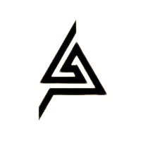

<!-- Improved compatibility of back to top link: See: https://github.com/othneildrew/Best-README-Template/pull/73 -->

<!--
*** Thanks for checking out the Best-README-Template. If you have a suggestion
*** that would make this better, please fork the repo and create a pull request
*** or simply open an issue with the tag "enhancement".
*** Don't forget to give the project a star!
*** Thanks again! Now go create something AMAZING! :D
-->

<!-- PROJECT SHIELDS -->
<!--
*** I'm using markdown "reference style" links for readability.
*** Reference links are enclosed in brackets [ ] instead of parentheses ( ).
*** See the bottom of this document for the declaration of the reference variables
*** for contributors-url, forks-url, etc. This is an optional, concise syntax you may use.
*** https://www.markdownguide.org/basic-syntax/#reference-style-links
-->
[![Contributors][contributors-shield]][contributors-url]
[![Forks][forks-shield]][forks-url]
[![Stargazers][stars-shield]][stars-url]
[![Issues][issues-shield]][issues-url]
[![MIT License][license-shield]][license-url]

<!-- PROJECT LOGO -->
 

  

<h3 align="center">Charge Edu-Tech Website</h3>

  

    A Landing page website made using Tailwind CSS
     
    <a href="https://github.com/Chanda1629/Charge-Edu-Tech-Website"><strong>Explore the docs »</strong></a>
     
     
    <a href="https://chanda1629.github.io/Charge-Edu-Tech-Website/">View Demo</a>
    ·
    <a href="https://github.com/Chanda1629/Charge-Edu-Tech-Website/issues">Report Bug</a>
    ·
    <a href="https://github.com/Chanda1629/Charge-Edu-Tech-Website/issues">Request Feature</a>
  

<!-- TABLE OF CONTENTS -->

  
Table of Contents

  <ol>
    <li><a href="#about-the-project">About The Project</a></li>
    </ol>

<!-- ABOUT THE PROJECT -->
## About The Project

[![Product Name Screen Shot][product-screenshot]](https://chanda1629.github.io/Charge-Edu-Tech-Website/)

(<a href="#readme-top">back to top</a>)

<!-- USAGE EXAMPLES -->
## Usage

This Project can be used as a starter template for any website. It is made using Tailwind CSS and is fully responsive. It can be used for any purpose.

_For more examples, please refer to the [Documentation](https://chanda1629.github.io/Charge-Edu-Tech-Website/)_

(<a href="#readme-top">back to top</a>)

<!-- LICENSE -->
## License

Distributed under the MIT License. See `LICENSE.txt` for more information.

(<a href="#readme-top">back to top</a>)

<!-- CONTACT -->
## Contact

Your Name - [@chanda](https://twitter.com/#) - dk3010079@gmail.com

Project Link: [https://github.com/Chanda1629/Charge-Edu-Tech-Website](https://github.com/Chanda1629/Charge-Edu-Tech-Website)

(<a href="#readme-top">back to top</a>)

<!-- MARKDOWN LINKS & IMAGES -->
<!-- https://www.markdownguide.org/basic-syntax/#reference-style-links -->
[contributors-shield]: https://img.shields.io/github/contributors/Chanda1629/Charge-Edu-Tech-Website.svg?style=for-the-badge
[contributors-url]: https://github.com/Chanda1629/Charge-Edu-Tech-Website/graphs/contributors
[forks-shield]: https://img.shields.io/github/forks/Chanda1629/Charge-Edu-Tech-Website.svg?style=for-the-badge
[forks-url]: https://github.com/Chanda1629/Charge-Edu-Tech-Website/network/members
[stars-shield]: https://img.shields.io/github/stars/Chanda1629/Charge-Edu-Tech-Website.svg?style=for-the-badge
[stars-url]: https://github.com/Chanda1629/Charge-Edu-Tech-Website/stargazers
[issues-shield]: https://img.shields.io/github/issues/Chanda1629/Charge-Edu-Tech-Website.svg?style=for-the-badge
[issues-url]: https://github.com/Chanda1629/Charge-Edu-Tech-Website/issues
[license-shield]: https://img.shields.io/github/license/Chanda1629/Charge-Edu-Tech-Website.svg?style=for-the-badge
[license-url]: https://github.com/Chanda1629/Charge-Edu-Tech-Website/blob/master/LICENSE.txt
[linkedin-shield]: https://img.shields.io/badge/-LinkedIn-black.svg?style=for-the-badge&logo=linkedin&colorB=555
[linkedin-url]: https://linkedin.com/in/linkedin_username
[product-screenshot]: ./assets/img/Screenshot.png
